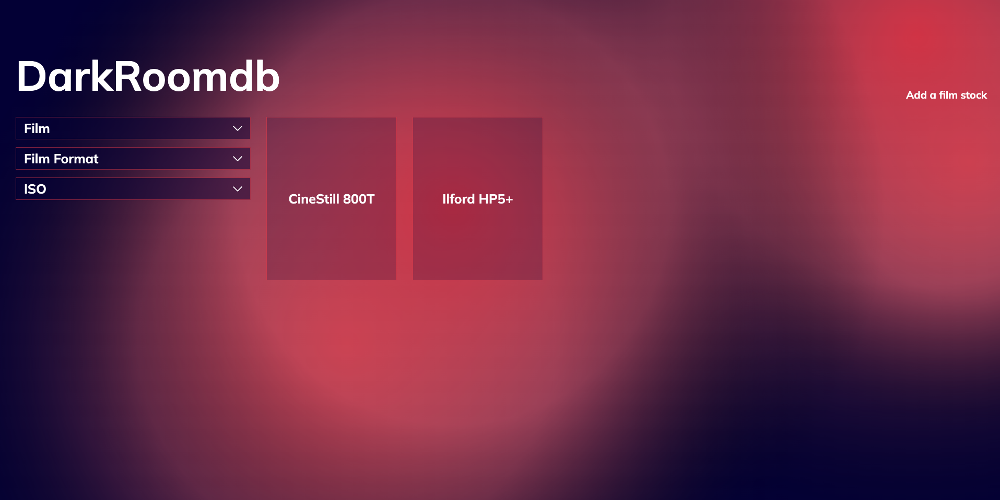

# Darkroomdb

_A screenshot of the live site._

## Project Overview

The goal of this project was to create a full-stack application. Java / Spring Boot was used in conjuction with MySQL to create an API with a database to store the relevant data that would then be added, removed, or simply viewed, using the front-end that was created using React.

## Design approach

The design of the front-end was drafted with a wireframe in Figma (all links can be seen at the bottom of this document). The website used react-router-dom to create a site with several pages. Users are able to see all the different films in the database when the page initially loads, and these films can be filtered by format, style, and ISO, using the filters on the sidebar.

HTML Canvas was used to create an interesting background, where a new blurry circle is added to the background on every re-render.

When a film on the homepage is clicked, the user is routed through to a film-specific page where data relating to that film is displayed. On this page, a user can select the button "add a rating" to add a rating to the database via a POST request.

Users can also add a film stock to the database using the button in the website header "add a film". All fields bar "rating" are required.

The front-end is deployed on GitHub, while the backend is deployed on the Google Cloud Platform.

## Links

### Deployed Site

https://samueljacobs98.github.io/darkroomdb-fe/

### Front-end GitHub Repo

https://github.com/samueljacobs98/darkroomdb-fe

### Back-end GitHub Repo

https://github.com/samueljacobs98/darkroomdb

### API Documentation

https://github.com/samueljacobs98/darkroomdb/blob/master/README.md

### Figma Design

https://www.figma.com/file/UBlMYiv0T53LXJKyecmdES/DarkRoomdb?node-id=0%3A1
